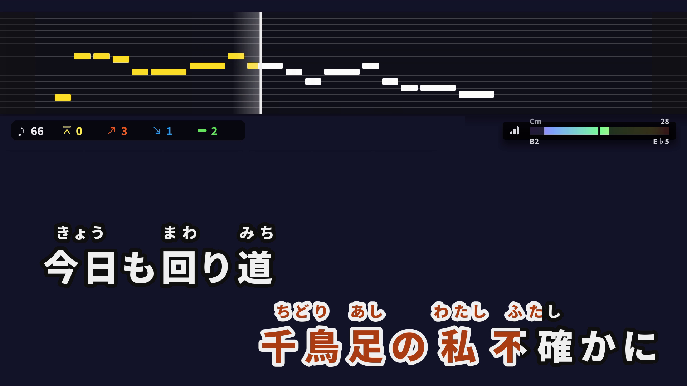
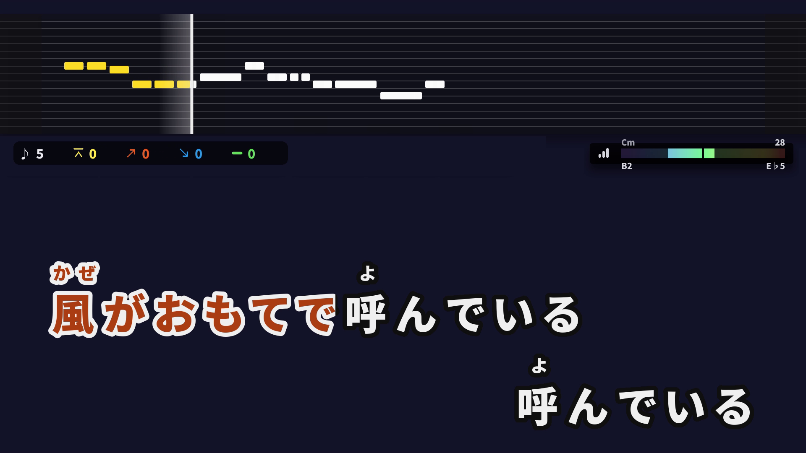
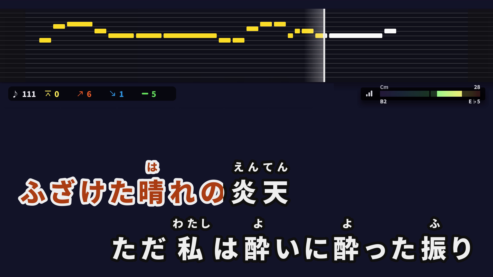
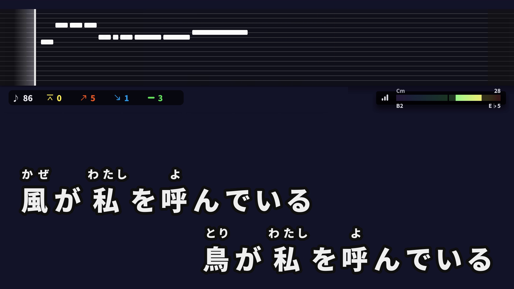
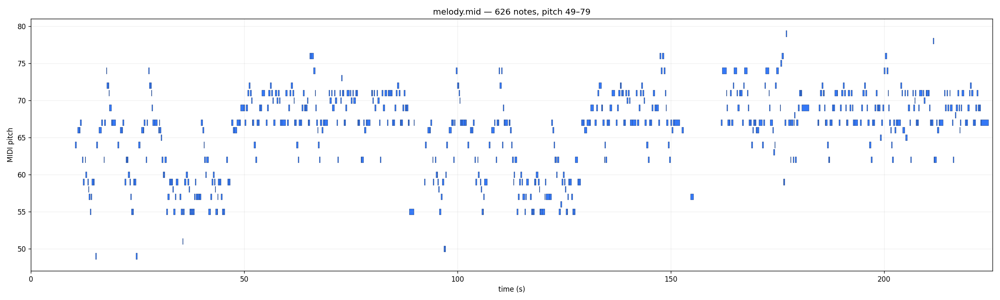

# karaoke-jp

**JOYSOUND 風日式卡拉 OK 影片自動生成器。** 一條 YouTube URL 進，一支 1080p60 練唱影片出 —— 離散音高方塊、逐字歌詞 wipe、自動振假名、可選背景。

> ⚠️ **僅限個人練唱自用，禁止商用、禁止上傳 YouTube 等任何公開平台。**
> Demucs / RoFormer 分離出的伴奏仍是原盤的衍生作品，JASRAC blanket license 不 cover，唱片公司會 Content ID claim。日本著作權法第 30 條私的使用只允許自用 reproduction。詳見 [spec.md](spec.md) §2。

---

## 成果

> 以下截圖一律用**純底**版面展示。pipeline 也支援把畫面疊在原 MV／專輯封面／靜態圖上，但那是版權衍生、僅限個人練唱自用，故不放進公開 repo。



<table>
  <tr>
    <td width="33%"></td>
    <td width="33%"></td>
    <td width="33%"></td>
  </tr>
  <tr>
    <td align="center"><sub>逐字 wipe — 現在音符高亮</sub></td>
    <td align="center"><sub>振假名 — 只標 kanji-run</sub></td>
    <td align="center"><sub>雙行歌詞 + 音域/調性 gauge</sub></td>
  </tr>
</table>


<p align="center"><sub>M2 抽出的 melody.mid（626 顆音符、音高 49–79）</sub></p>

支援 **橫式 16:9** 與 **直式 9:16** 兩種版面；背景可用原 MV、靜態圖、純黑底或 MID2BAR 預設藍漸層（純底／靜態圖可公開分享，疊原片僅限自用）。

---

## Pipeline

```
YouTube URL / 本地音訊
  └─ download   ─► source.wav, background.mp4         (M0 · yt-dlp)
       └─ separate  ─► vocals.wav, instrumental.wav   (M1 · Mel-Band-RoFormer)
            ├─ melody  ─► melody.mid                  (M2 · RMVPE / CTC+CE / GAME)
            └─ tokenize + align ─► aligned.json       (M3 · fugashi + MMS CTC)
                 ├─ midi_timing  ─► aligned_midi.json (mora→note 對齊)
                 ├─ export_lrc   ─► karaoke.lrc       (MID2BAR 格式 + @RubyN)
                 ├─ mix          ─► mixed.wav         (instrumental + 20% guide vocal)
                 └─ render       ─► karaoke.mp4       (M4 · headless MID2BAR-Player)
```

每個階段是一條 Snakemake rule，cache 友善：改了哪一支腳本只重跑下游。完整規格見 [spec.md](spec.md)。

---

## 使用的技術

| 階段 | 技術 | 用途 |
|---|---|---|
| **M0 下載** | [yt-dlp](https://github.com/yt-dlp/yt-dlp) | YouTube 拉音訊 + 背景影片；偏好 h264 720p，避開 OpenCV 軟解不了的 AV1 |
| **M1 人聲分離** | [Mel-Band-RoFormer](https://github.com/openmirlab/melband-roformer-infer)（KimberleyJensen Kim FT2 Bleedless）| source → vocals + instrumental |
| **M2 旋律抽取** | [RMVPE](https://github.com/Dream-High/RMVPE)（預設）／ [CTC+CE](https://github.com/york135/CTC_CE_for_AST)（CRNN 一次出 onset/offset/pitch，低音域比 RMVPE 穩）／ [SOME](https://github.com/openvpi/SOME)（legacy） | vocals → MIDI 音符序列 |
| **M2b 音高顯示** | GAME note transcription + beat-grid quantize | canonical pitch bar 來源；八度修正、union 補音 |
| **調性偵測** | [Essentia](https://essentia.upf.edu/) | HUD 的調性/音域 gauge（GiantSteps 0.717，勝 peak-PCP 0.546） |
| **M3a 形態素解析** | [fugashi](https://github.com/polm/fugashi) + UniDic | 切詞取讀音；只給 kanji-run 發振假名（hiragana 不發） |
| **M3b 歌詞 timing** | MMS-300m CTC **forced alignment**（卡拉 OK 微調 ckpt）+ RMS 句尾延伸 | 已知 mora 序列羅馬化後對分離人聲對齊；**ASR 完全退出 timing 鏈**，幻覺問題從根消失 |
| **M3b（legacy）** | [faster-whisper](https://github.com/SYSTRAN/faster-whisper) large-v3 + Needleman-Wunsch kana 對齊 | classic 鏈，可 `TIMING_SOURCE=classic` A/B |
| **M3c mora→note** | bounded greedy-monotone 配對 | Whisper word ts 對唱歌不準（「再会」會被切 2 char），改用 MIDI note onset per-mora 對齊 |
| **M4 LRC + 渲染** | 自製 `@RubyN=` 拆分 → [MID2BAR-Player](https://github.com/keisuke-okb/MID2BAR-Player)（fork 成 headless） | MIDI + LRC + audio → 1080p60 h264 MP4 |
| **M5 混音** | ffmpeg `amix` | instrumental + 20% guide vocal，可調人聲比例 |
| **編排 / GUI** | [Snakemake](https://snakemake.github.io/) · [Gradio](https://www.gradio.app/) | 一條 DAG 跑完所有 stage；本機 GUI 包裝同一條 pipeline |

> **音高里程碑**：樂譜層音高推論將 chidori note-level 從 52.6% 拉到 **72.8%**（sheet + 人耳全驗證 gold）。歌詞 timing 從 ASR 改 CTC forced alignment 後，三首歌加權句首 MAE 0.090→**0.070**、句尾 0.098→**0.092**。方法論與計分板見 [docs/pitch-benchmark.md](docs/pitch-benchmark.md)。

---

## 安裝

**前置**：Python 3.10–3.12 · NVIDIA GPU + CUDA 12/13 · `git wget unzip ffmpeg curl`

```bash
git clone https://github.com/Lanternko/karaoke-jp.git
cd karaoke-jp
bash scripts/setup.sh
```

> `gold/` 是私有 submodule（人耳/樂譜驗證 pitch references，版權故不公開）。公開使用者**不需要**它（只有 eval/benchmark 用得到）；有存取權者跑 `git submodule update --init`。

`setup.sh` 約 10 分鐘（看 checkpoint 下載速度），idempotent —— 失敗重跑只補做未完成步驟。會自動：

1. 建 5 個 venv（套件版本互衝故刻意分開，詳見 [CLAUDE.md](CLAUDE.md)「環境隔離」）
2. clone 第三方 repo（SOME / CTC_CE_for_AST / MID2BAR-Player / GAME）到 `third_party/`
3. 下載 checkpoint（RMVPE / SOME / CTC+CE / MMS 微調）
4. 跑 smoke test 確認各 venv 都 import 得了關鍵套件

---

## 一鍵跑完

```bash
# 1. 下載歌
~/venvs/karaoke-jp/bin/python scripts/download_song.py 'https://youtu.be/<id>' -o songs/<song-id>/

# 2. 把歌詞貼進 songs/<song-id>/lyrics.txt（純文字，每行一句）

# 3. 跑整條 pipeline
~/venvs/karaoke-jp/bin/snakemake --rerun-triggers mtime -j 1 outputs/<song-id>/karaoke.mp4
```

產出：`outputs/<song-id>/karaoke.mp4`。

- **直式 9:16**：`/render-portrait <song-id>`（雙行交替 pitch bar + 歌詞，1080×1920）
- **切換旋律 backend**：`MELODY_BACKEND=cectc snakemake ...`
- **Lyric Video 背景**：來源已燒入歌詞時加 `--no-video`，自備 `background.png` 避免撞圖
- **已有樂譜 MIDI**：`karaoke-jp score-melody ... --score-midi score.mid`，把樂譜當 pitch ground truth、audio 只決定 timing

### GUI

```bash
~/venvs/karaoke-jp/bin/pip install -e '.[batch,gui]'
~/venvs/karaoke-jp/bin/karaoke-jp gui --host 127.0.0.1 --port 7860
```

本機 Gradio 介面包裝同一條 pipeline：輸入 YouTube URL 或上傳 mp4、貼歌詞、拉人聲混音比例、選背景模式。預設只綁 `127.0.0.1`，不開 share。

---

## 目錄結構

```
karaoke-jp/
├── src/karaoke_jp/   # 主 package（separate, melody, ruby, align, lrc_export, midi_markers, cli, gui）
├── scripts/          # 各 stage subprocess 跑的 CLI（含 forced_align_mms.py）
├── Snakefile         # pipeline DAG：separate → melody → align → midi_timing → {lrc, markers} → mix → render
├── config/           # mid2bar_settings.json + versions.json（canonical 版本 pointer）
├── benchmarks/       # MIR-ST500 / Kiritan / phone-boundary 評估與結果
├── gold/             # 人耳/樂譜驗證 pitch references（私有 submodule，版權故不公開）
├── data/             # alignment gold tsv
├── songs/<id>/       # source.md tracked；lyrics.txt 本地未追蹤（版權）；音檔/影片 gitignored
├── outputs/<id>/     # 中間檔 + karaoke.mp4（gitignored）
├── overrides/        # 每首歌的 ruby override JSON（gikun 用）
├── figures/          # README 截圖（純底版；疊版權背景的不公開）
├── third_party/      # 外部 repo（gitignored，setup script clone）
└── spec.md  CLAUDE.md  MEMORY.md  docs/  pyproject.toml
```

---

## 文件

| 檔案 | 內容 |
|---|---|
| [spec.md](spec.md) | 完整技術規格、pipeline、里程碑、版權分析 |
| [CLAUDE.md](CLAUDE.md) | 工作指南、關鍵決策、踩坑（NEVER 清單）、環境隔離 |
| [MEMORY.md](MEMORY.md) | 決策歷史、為什麼選 X 不選 Y |
| [docs/pitch-benchmark.md](docs/pitch-benchmark.md) | 音高 gold 方法論、benchmark、canonical 鏈 |
| [docs/display-grid.md](docs/display-grid.md) | 標準化 bar 顯示系統（grid + 時間 warp） |

---

## 設計取捨（不要再爭論）

- **Fork MID2BAR-Player，不從零寫 renderer** —— MID2BAR 已實作 JOYSOUND 風 ruby + 音高方塊 + ffmpeg encode；UltraStar 系列無 ruby 語法且不支援 MP4 export。
- **Timing 用 mora→note alignment / CTC forced alignment** —— Whisper word timestamp 對唱歌不準，且 ASR 文字會幻覺。
- **不做連續 f0 曲線** —— 要的是 JOYSOUND 風格離散音高方塊。
- **不用 pykakasi 做振假名**（沒形態素解析，常選錯讀音）；**不用 CREPE 做 pitch**（已被 RMVPE / SOME 取代）。

更多踩坑見 [MEMORY.md](MEMORY.md)。

## License

程式碼 MIT（見 [pyproject.toml](pyproject.toml)）。**產出影片僅限個人練唱自用，不得商用或公開上傳。**
